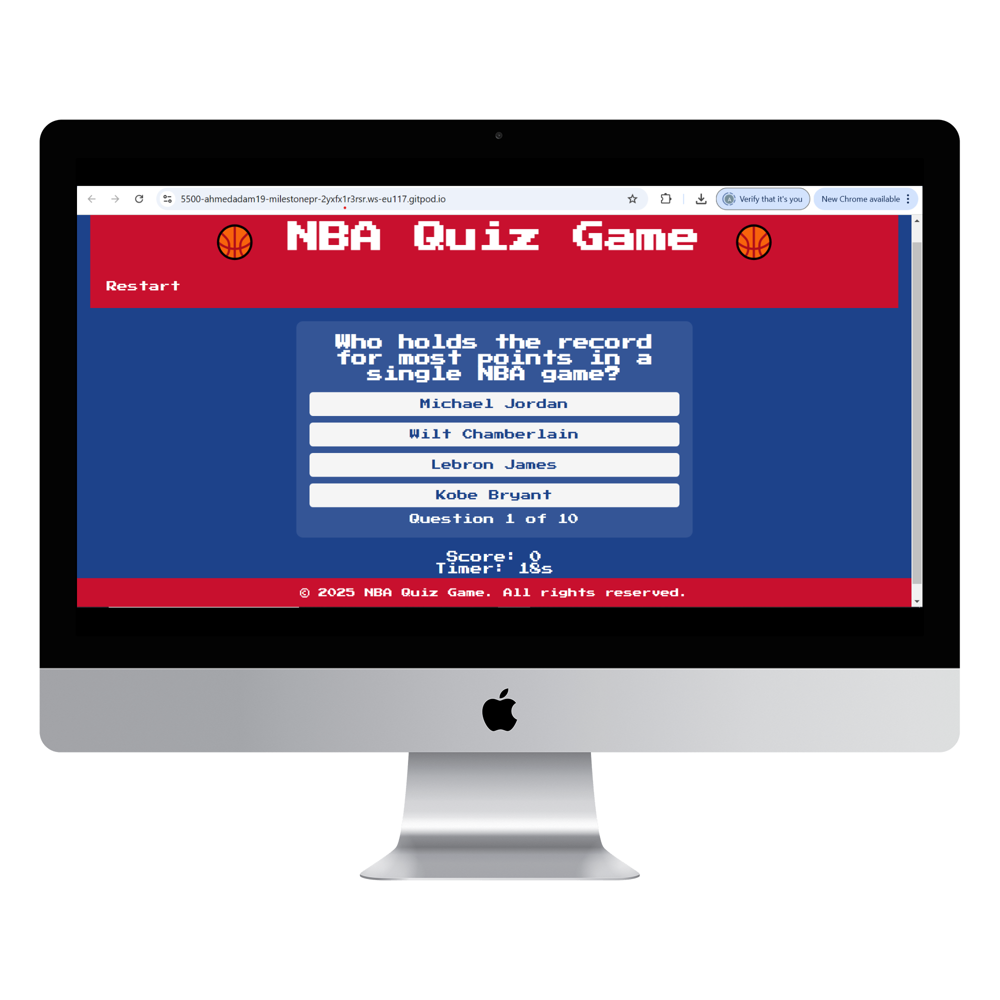
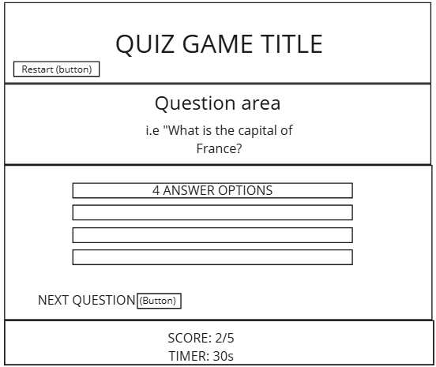
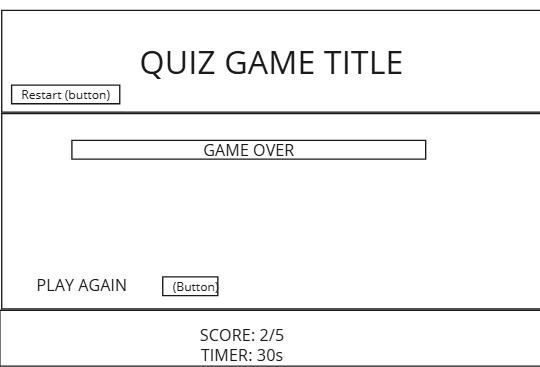
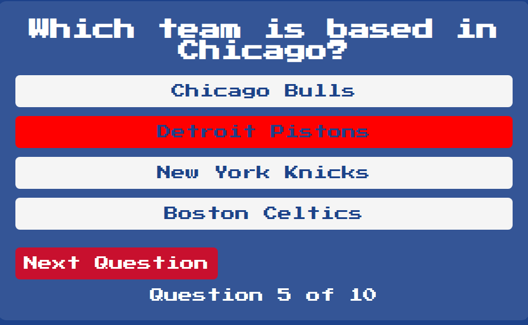
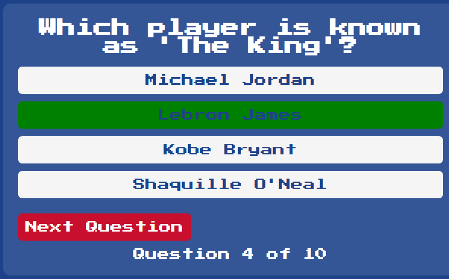
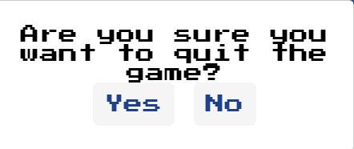

# NBA Quiz Game

Try and beat your high score in this NBA-themed quiz game where your aim is to answer questions correctly in as little time as possible.

Live site:[Live site](https://ahmedadam1998.github.io/Milestone-Project-2/)

## Index - Table of Contents

- [Design](#design)
    - [Wireframes](#wireframes)
    - [Font and Colour Choices](#font-and-colour-choices)
- [Features](#features)
    - [Existing Features](#existing-features)
    - [Future Features](#possible-future-features)
- [UX](#ux)
    - [Site Goals](#site-goals)
    - [User Stories](#user-stories)
- [Testing](#testing)
    - [Validator Testing](#validator-testing)
    - [Browser Testing](#browser-testing)
    - [Manual Testing](#manual-testing)
    - [Testing User Stories](#testing-user-stories)
    - [Fixed Bugs](#fixed-bugs)
    - [Unfixed Bugs](#unfixed-bugs)
    - [Code](#code)
    - [Content](#content)

## Design

This game was designed with simple, intuitive functionality in mind. The layout is kept minimal so that users can focus on testing their NBA knowledge. The design draws inspiration from modern sports apps with a bold, energetic colour scheme.

### Wireframes

The first Wireframe illustrate the layout and core features of the game, whilst the second illustrates when the game is over.

### Font and Colour Choices

**Fonts:**  
We use bold, athletic-style fonts to match the sports theme. 
"Bangers" font directly from Google Fonts. "wild_world" font from Befonts.

**Colours:**  
The primary colours are based on NBA team colours and modern design trends, with a dark background accented by vibrant highlight colours.

## Features

The site includes all core features of an interactive quiz game.

### Existing Features

- **Landing Overlay**

  - Displays on site load with a "Play Now" button.
  - Allows users to see instructions and total question count.
- **Quiz Area**

  - Displays questions, multiple-choice answers, and a timer.
  - Updates score as the game progresses.
- **Question Counter**

  - Shows which question the user is currently on.
- **Footer**

  - Contains copy right.
- **Incorrect Answer**

  -Highlights answer red.
- **Correct Answer**

  -Hightlights answer green.
- **Game over section**
  
  -Shows user their final score and allows them to click play again button that leads them back to landing page!
 - **Restart Modal**
 
  -Gives user the option of restarting the game or resuming the game. 
### Possible Future Features

- Additional difficulty levels.
- Enhanced animations and sound effects.
- User profile and score history.

## UX

### Site Goals

The game aims to be engaging and challenging, providing quick feedback and clear instructions. The design is accessible and easy to navigate.

### User Stories

**As a user, I want to:**
- Quickly understand the game rules.
- See my current score and progress.
- Easily restart the game.
- View a responsive design across devices.

**As the developer, I want to:**
- Maintain a clean, modular codebase.
- Ensure the game is accessible and performs well.

## Testing

### Validator Testing

- HTML and CSS have been validated using W3C Validator and CSS Jigsaw.

- JavaScript is linted with JSHint.

### Browser Testing

Tested on:
- Chrome, Edge, Firefox, Safari

### Manual Testing

| Feature              | Expectation                                                  | Result  |
|----------------------|--------------------------------------------------------------|---------|
| Landing Overlay      | Should display instructions and total question count         | ✔       |
| Quiz Area            | Displays questions, timer, and score correctly               | ✔       |
| Answer Selection     | Only the selected answer highlights correctly                | ✔       |
| Modal Functionality  | "Restart" button pauses the game and shows modal correctly     | ✔       |

### Testing User Stories

All user stories have been tested and confirmed to work as expected.

### Fixed Bugs

Refer to commit logs for details on resolved issues.

### Future Improvements

-Update README from beginning.
-Use Terminal for pushing and commiting.
-Always use present tense for writing commits, make sure it is adhering to Industry Standards.

### Deployment
Deployment
This site was deployed via GitHub pages using the following steps: From the GitHub repository, navigate to Settings In the left-hand navigation section select Pages From the source section drop-down menu change Branch from none to main and click the Save After several minutes the website is live and will be automatically refreshed with each Git push command. The link to the live site is: https://ahmedadam1998.github.io/Milestone-Project-2/

To run locally: Log into GitHub and click on repository to download (https://github.com/AhmedAdam1998/Milestone-Project-2) Select Code and click "Download the Zip file. Once download is completed, extract ZIP file and use in your local environment. Alternatively you can Clone or Fork this repository into your GitHub account.

### Code

- Quiz logic inspired by tutorials on memory games and timers.
- Modal and landing overlay functionality from modern web development best practices.

### Content

- Content and questions curated and adapted for the NBA theme.